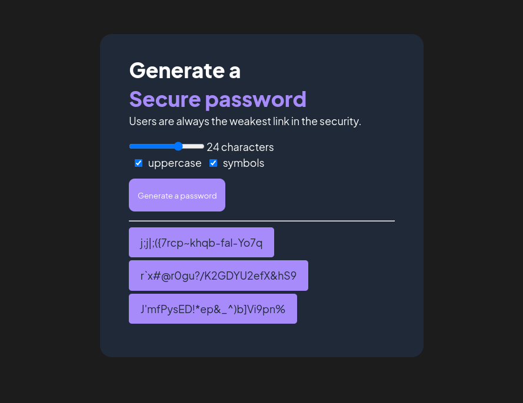

# Random Password Generator
A demonstration of vanilla Javascript's randomisation function to generate a string consists of character for password use. The project is part of Scrimba curriculum challenges. 

[View App](https://venerable-melba-00f860.netlify.app/)